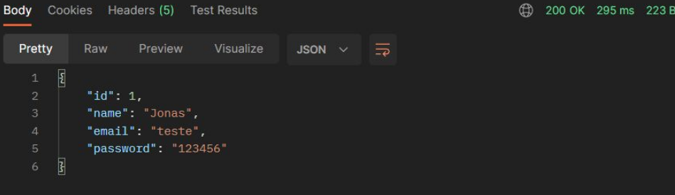

# PASSO A PASSO PARA INICIAR UM PROJETO SIMPLES DE SPRING BOOT
## BASEADO NO CURSO DO PROFESSOR NÉLIO NA UDEMY.


Primeiro deve-se ter em mente o projeto que vai desenvolver.  
  
Vamos exemplificar como iniciar um projeto de CRUD de Usuários de um sistema.  
  

## 1 - Configuração do Banco de Dados de teste.

Será preciso configurar o banco de dados dentro da pasta _**resources**_ que está na raíz do projeto.  
Nesse exemplo vamos criar um banco de dados em memória H2 para servir pros testes.  
  

### Obs.: Usando banco de dados H2:

-   Criar arquivo _**application.properties**_  
    
    Inserir no arquivo:  
      
    ``````
    spring.profile.active=test  
    spring.jpa.open-in-view=true
    ``````
      
    
-   Criar arquivo _**application-test.properties**_  
    Inserir no arquivo:  
      
    ``````
     # DATASOURCE  
     spring.datasource.driverClassName=org.h2.Driver  
     spring.datasource.url=jdbc:h2:mem:testdb  
     spring.datasource.username=sa  
     spring.datasource.password=  
     # H2 CLIENT  
     spring.h2.console.enabled=true  
     spring.h2.console.path=/h2-console  
     # JPA, SQL  
     spring.jpa.database-platform=org.hibernate.dialect.H2Dialect  
     spring.jpa.defer-datasource-initialization=true  
     spring.jpa.show-sql=true  
     spring.jpa.properties.hibernate.format_sql=true  
    ``````
    

  

##   

### Obs.: Usando banco de dados PostgreSQL:

-   Criar arquivo _**application.properties**_  
    
    Inserir no arquivo:  
      
    ``````
    spring.profile.active=pgsql  
    spring.jpa.open-in-view=true  
    ``````   
    
-   Criar arquivo _**application-pgsql.properties**_  
    Inserir no arquivo:  
      
    ``````
    # DATASOURCE  
    spring.datasource.url=jdbc:postgresql://localhost:5432/developer (nome do servidor)  
    spring.datasource.username=postgres  
    spring.datasource.password=admin  
      
    # JPA  
    spring.jpa.hibernate.ddl-auto=update # Se a tabela mudar atualiza na base de dados automatico  
    spring.jpa.properties.hibernate.jdbc.lob.non_contextual_creation=true # Não seja criado log do hibernate (testar sem pra ver se funciona)  
    ``````

  

  

## 2 - Criação das pastas dos tipos de classes.

Teremos 4 tipos de classes, onde serão criadas 4 pastas na pasta do projeto:

1.  entities (ou models no mvc)
2.  repositories
3.  resources (ou controller no mvc)
4.  services

A pasta  _**entities**_ irá tratar as classes de domínio

A pasta _**repositories**_ irá tratar a _interface_ que irá extender a interface _**JPARepository< x, y>**_

A pasta  _**resources**_  irá tratar dos endpoints para a API  

A pasta _**services**_ irá realizar as operações no banco de dados

  


## 3 - Iniciando as classes entities (models).

Na classe entidade serão usadas 3  _annotations_ que serão importadas da biblioteca  _**Javax.persistence**_.

-   @Entity(name="tb_user")
-   @Id
-   @GeneratedValue(strategy = GenerationType.IDENTITY)

O annotation _**@Entity(name = "tb_users")**_ irá servir pra dizer que a classe User irá ter uma tabela no bd com o nome  _tb_users_

O annotation  _**@Id**_  irá dizer para o bd que o campo id irá ser um campo identificador (unique)  

O annotation  _**@GeneratedValue(strategy = GenerationType.IDENTITY)**_  irá dizer que o campo id é a chave primária (ID) autoincrementável.

  

A classe será criada como uma classe concreta qualquer.

Iremos passar os atributos, construtores, getters/setters, hash e equals e toString. E por fim implementar o serializable (Sair metendo  _ctrl+ ._ ).

  

_**OBS.: TODAS AS ANNOTATIONS DEVEM SER DO JAKARTA. (Adicionar no Pom.xml o Validation).**_  

  

A classe User ficará então assim:

[https://github.com/2023111epdmd0086/spring-passo-a-passo/blob/main/src/main/java/com/example/demo/entities/User.java](https://github.com/2023111epdmd0086/spring-passo-a-passo/blob/main/src/main/java/com/example/demo/entities/User.java)  

  

  

## 4 - Iniciando as interfaces repositories.

Será preciso utilizar a annotation  _**@Repository**_ para definir uma interface como repositório.

Essa interface é bem simples. Ela irá extender uma interface JPARepository<Classe, TipoIdentificador>.

  

A classe  _**UserRepository**_ ficará assim:

_**public interface UserRepository extends JpaRepository<User, Integer> { ... }**_

  

  

  

  

  

## 5 - Iniciando as classes services.

As classes services irão implementar os repositories.

Essa classe irá fazer uso das annotations abaixo:

-   @Service
-   @Autowired

Quando for iniciar a classe service, deverá colocar antes da classe a annotation _**@Service**_ que irá identificar a classe como um serviço.

Antes de iniciar o UserRepository repository deverá colocar o _**@Autowired**_ que servirá para injeção de dependência na interface.

  

1.  Adicionar a annotation _**@Service**_ em cima da classe criada.
2.  Instanciar um objeto do tipo Repository que for usar na classe Service com annotation  _**@Autowired**_.  
    Exemplo:  
    
    _**@Autowired**_
    
    _**private UserRepository repository;**_
    
      
    
3.  Criar as funções que irão realizar as transações no banco de dados.  
    

1.  Criar função findAll( ) do tipo List de Users. Essa função irá retornar a lista de usuários:  
    Exemplo:  
    
    _**public List<User> findAll( ) { return repository.findAll( ); }**_
    
      
    
2.  Criar a função findById(Integer id) do tipo User que irá retornar um User obj.get( ):  
    Obs.: Pode ser que não ache nada, por isso será usado  _**Optional.**_  
    Exemplo:  
    
    _**public User findById(Integer id) {**_
    
    _**Optional<User>  obj = repository.findById(id);**_
    
    _**return obj.get();**_
    
    _**}**_
    
3.  Criar a função de inserção do tipo User:  
    Função simples, irá simplesmente receber um User u e retornar um repository.save.  
    Exemplo:  
    
    _**public User insert(User user) { return repository.save(user);}**_
    
      
    
4.  Criar função de deletar do tipo void:  
    Outra função simples, irá receber um Integer id e realizar um repository.deleteById.  
    Exemplo:  
    
    _**public void delete(Integer id) { repository.deleteById(id); } **_
    
5.  Criar função de update do tipo User:  
    Essa função é mais chatinha e precisará criar uma instancia do objeto que quer atualizar pra auxiliar:  
    Exemplo:  
    
    _**public User updateById(User obj, Integer id) {**_
    
    _// Pegar a referência do Objeto que irá atualizar pelo seu ID:_
    
    _**User entity = repository.getReferenceById(id);**_
    
      
    
    _**entity.setName(obj.getName());**_
    
    _**entity.setEmail(obj.getEmail());**_
    
    _// Salvar o objeto novo em cima do objeto antigo_
    
    _**return repository.save(entity);**_
    
    _**}**_
    

  

A classe toda está disponível no commit do github:

[https://github.com/2023111epdmd0086/spring-passo-a-passo/commit/0a5bd4118e1935c4f21b8b828029170c46bb911a](https://github.com/2023111epdmd0086/spring-passo-a-passo/commit/0a5bd4118e1935c4f21b8b828029170c46bb911a)  

  

  

  

## 6 - Iniciando as classes resources (controllers).

As classes resources irão fazer composição com as classes services.

Essa classe irá fazer uso das annotations abaixo:

-   @RestController
-   @RequestMapping(value="/URI-Controller")
-   @Autowired

A annotation _**@RestController**_ irá se responsabiliizar por definir a classe como um Controller REST.

A annotation  _**@RequestMapping**_  irá se responsabilizar por definir a URI que será usada no endpoint.

A annotation  _**@Autowired**_  será usada antes de instanciar o objeto Service que o controller usará.

  

Annotations dos métodos:

-   @GetMapping

-   Variações:
-   _**@GetMapping(value = "/{id}")**_
    
    _**public ResponseEntity<User> findById(@PathVariable Integer id) { ... }  **_
    

-   @PosMapping

-   Variações:
-   _**@PostMapping**_
    
    _**public ResponseEntity<User> insert(@RequestBody User obj) { ... }  **_
    

-   @PutMapping

-   Variações:  
    
-   _**@PutMapping(value = "/{id}")**_
    
    _**public ResponseEntity<User> update(@PathVariable Integer id, @RequestBody User obj) { ... }**_  
      
    

-   @DeleteMapping

-   Variações:  
    
    _**@DeleteMapping(value = "/{id}")**_
    
    _**public ResponseEntity<Void> delete(@PathVariable Integer id) { ... }**_
    

  

  

O GetMapping sem parâmetros vai ser quando for usado o método get sem parâmetros.

Normalmente os métodos que iremos criar, irão ser do tipo _**ResponseEntity<Classe>**_ pois irão retornar um http response.

  

1.  Criação do método findAll( ):  
    Como vai ser um método Get, iremos usar a annotation _**@GetMapping**_ sem valor de pathVariable.  
    O método será do tipo  _**ResponseEntity<List<User>>**_  
    Exemplo:  
    
    _**@GetMapping**_
    
    _**public ResponseEntity<List<User>> findAll() {**_
    
    _**List<User> lista = service.findAll();**_
    
    _**return ResponseEntity.ok().body(lista);**_
    
    _**}**_
    
      
    
2.  Criação do método findById( ):  
    Dessa vez, será preciso fazer um GetMapping com parametros no path.  
    O método será do tipo  _**ResponseEntity<User>**_  
    Exemplo:  
    
    _**@GetMapping(value = "/{id}")**_
    
    _**public ResponseEntity<User> findById(@PathVariable Integer id) {**_
    
    _**User u = service.findById(id);**_
    
    _**return ResponseEntity.ok().body(u);**_
    
    _**}  **_
    
3.  Criação do método insert( ):  
    Dessa vez, será preciso fazer um PostMapping, com parametros passados pelo body da request.  
    O método será novamente do tipo RequestMapping<User>  
    
    Exemplo:  
    
    _**@PostMapping**_
    
    _**public ResponseEntity<User> insert(@RequestBody User user) {**_
    
    _**user = service.insert(user);**_
    
    _**return ResponseEntity.ok().body(user);**_
    
    _**}**_
    
      
      
    
4.  Criação do método update():  
    Dessa vez será preciso fazer um PutMapping, com os parâmetros de body e o ID pela request.  
    O método será do tipo RequestMapping<User>  
    Exemplo:  
    
    _**@PutMapping**_
    
    _**public ResponseEntity<User> update(@RequestBody User user, @PathVariable Integer id) {**_
    
    _**user = service.updateById(user, id);**_
    
    _**return ResponseEntity.ok().body(user);**_
    
    _**}**_
    
      
      
    
5.  Criação do método delete():  
    O método mais molim de todos.  
    Método do tipo ResponseEntity<Void> que irá receber um Integer e retornar um  _**noContent( )**_.  
    Exemplo:  
    
    _**@DeleteMapping(value = "/{id}")**_
    
    _**public ResponseEntity<Void> delete(@PathVariable Integer id) {**_
    
    _**service.delete(id);**_
    
    _**return ResponseEntity.noContent().build();**_
    
    _**}**_
    

  

A classe toda está disponível no Github:  
[https://github.com/2023111epdmd0086/spring-passo-a-passo/commit/2f24020f9f006a6c08ea7bab0b0a3b9188a99467](https://github.com/2023111epdmd0086/spring-passo-a-passo/commit/2f24020f9f006a6c08ea7bab0b0a3b9188a99467)  

  

  

  

  

  

  

  

  

## 7 - Consumindo a API.

Após rodar o programa, o console nos retornará a conexão com o BD H2 de teste.


  

Entrar com esse URL na conexão do H2


_**NÃO DAR ENTER!!!!! SÓ APERTAR EM Connect**_

  

  

Com o POSTMAN é possível testar os comandos, e ver se está atualizando no H2.



  

  

No H2 é pra atualizar:

